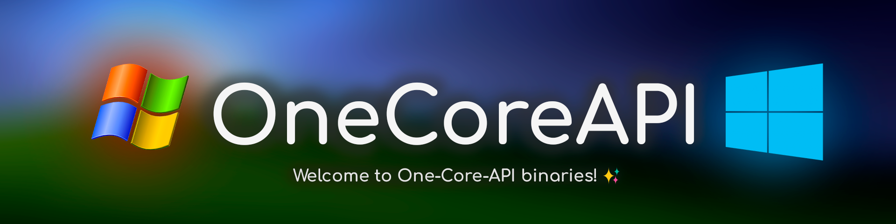

  
  <h6>特别感谢 @pashtetusss777 设计的横幅</h6>

***
**语言:**    
[English](README.md) | [简体中文](README_CN.md) | [Русский](README_RU.md) | [Українська](README_UK.md) | [日本語](README_JP.md) | [Português-Brasil](README_BR.md)

**这份中文自述由 [Mike Wang](https://github.com/Diamochang) 贡献。由于翻译底稿系深度求索 [DeepSeek R1 671B](https://github.com/deepseek-ai/DeepSeek-R1) 生成，尽管经过人工校对和修改，但难免有遗漏或错误。如有建议，可以在创建相关 Issue 或 PR 时在描述中 @ 他。**
***

**本仓库包含 One-Core-API 项目的二进制发行版，兼容 Windows Server 2003 RTM/SP1/SP2、Windows XP RTM/SP1/SP2/SP3 及 Windows XP x64 SP1/SP2。强烈建议使用最新 SP（服务包）和所有可用更新的系统。**

<!-- **官方 Discord 服务器**: <h2>https://discord.gg/eRcGuFtn6p</h2> -->

- [核心功能](#核心功能)
  - [使用前须知](#使用前须知)
- [如何安装 One-Core-API？](#如何安装-one-core-api)
- [如何卸载 One-Core-API？](#如何卸载-one-core-api)
- [应用程序兼容性](#应用程序兼容性)
- [已知限制](#已知限制)
- [提交问题前...](#提交问题前)
- [仓库结构](#仓库结构)
- [扩展信息与链接](#扩展信息与链接)
  - [官方 Discord 服务器](#官方-discord-服务器)
- [效果展示](#效果展示)

## 核心功能
- **默认支持 x86 系统 128 GB 内存和 x64 系统 2 TB 内存**
- **支持通过设置兼容性模式运行为现代 Windows 系统设计的新程序**
- **支持搭载新硬件控制器驱动的现代硬件**
- **全面支持 Windows XP 和 Windows Server 2003 的所有语言版本**

### 使用前须知
- 本软件使用了来自各系统的修改文件，包含尚处于测试或实验阶段的内容，且**由作者一个人开发维护**。由于不同计算机配置或虚拟环境的复杂性，无法预测所有可能场景。

- **从 Windows XP / Server 2003 到 Vista 的过渡带来了大量新 API、技术革新和现有 API 的调整，这使得在 NT 5.x 与 NT 6.x 系统间实现完全兼容极具挑战。**

- 希望你保持冷静与谨慎，践行开源精神。在判定软件存在缺陷或“质量低劣”之前，**请通过 [GitHub Issues](https://github.com/Shorthorn-project/One-Core-API-Binaries/issues) 或 [Discord 服务器](https://discord.gg/eRcGuFtn6p)** 反馈问题。

- 请注意，我无法保证解决所有问题，但会认真分析并尽力修复。你的帮助至关重要，抱怨与负面评价无益于项目改进。

## 如何安装 One-Core-API？

One-Core-API 采用 Windows NT 5.x 及更早系统的补丁安装技术，其安装过程与服务包更新类似。请前往[发行版](https://github.com/shorthorn-project/One-Core-API-Binaries/releases)页面选择版本并下载压缩包（`.zip`）。解压后可见按平台分类的 `x64` 和 `x86` 文件夹，内含 `One-Core-API-Pack.exe` 安装程序。双击运行并按向导指引操作即可（下一步 -> 接受协议 -> 完成）。

### 图解

1. **下载示例：**

2. **解压文件：**

3. **选择架构（无 x64 标识则为 x86）：**

4. **双击安装程序：**

5. **进入向导：**

6. **接受协议并继续：**

7. **等待安装完成：**

8. **完成安装并重启：**

## 如何卸载 One-Core-API？

通过控制面板的更新管理功能卸载：打开 **控制面板 -> 添加/删除程序**，勾选 **“显示更新”**，在列表中找到“One-Core-API Pack”并点击 **“删除”** 按钮，按向导指引操作即可。

### 图解

1. **打开控制面板：**

2. **进入“添加或删除程序”：**

3. **勾选显示更新：**

4. **定位 One-Core-API 条目：**

5. **点击删除按钮：**

6. **进入卸载向导：**

7. **等待卸载完成：**

8. **完成卸载并重启：**

## 应用程序兼容性
- JetBrains IDE 全系列至最新版本（2024）
- Android Studio 全系列至最新版本
- NetBeans 全系列至最新版本
- Eclipse IDE 全系列至最新版本
- Adobe 系列产品（Photoshop / Illustrator / Dreamweaver 等）至 2019 版
- FileZilla（最新版）
- LibreOffice 24.0.x（最新版）
- Discord 0.309.0
- Legocord（Discord 分支）最新版
- Visual Studio 2012 / 2013
- Visual Studio Code（及 Codium 等分支）至最新版
- Chromium 内核浏览器（Chrome / Opera / Edge 等）至最新版
- Gecko 内核浏览器（Firefox / Zen Browser）至最新版（对于 Firefox，YouTube 仅支持至 130 版。北京谋智火狐开发的本地版本同样支持。）
- Seamonkey 至 2.53.10 版
- Thunderbird（雷鸟）至最新版
- Maxthon 至 7.1.6 版
- Vivaldi 至最新版
- JDK 1.8（当前仅限 Windows XP x64）
- Java JDK 及 OpenJDK 至 24 版（其他版本可能兼容），下载地址：https://bell-sw.com/pages/downloads/#/java-11-lts
- Epic Browser 120
- Python 3.6（3.8 / 3.9 需使用[修改版](https://mega.nz/folder/KxExlAiC#L9rAQ5kTCtlHgZUwaxMpgw)）
- .NET Framework 至 4.8 版
- .NET 6.0
- Geekbench 4.2
- Performance Test
- Adobe Acrobat Reader DC（至 2024 版）
- 福昕 PDF 阅读器至最新版
- Windows 7 原生游戏
- Windows 7 画图
- Windows 7 写字板
- Windows Vista 原生应用
- Windows 7 / 10 版 Spotify
- LINE
- Zoom
- Node 10.24
- Telegram Desktop
- WinRAR 7.0（最新版）
- Postman
- Insomnia
- DBeaver
- TeamViewer 14
- 支持 DirectX 9EX / 10 / 11 的游戏：
  - 极品飞车：最高通缉 2012
  - 极品飞车：亡命狂飙
  - 街头霸王 V
  - 不义联盟：人间之神
  - 刺客信条：黑旗
  - 孤岛危机 1 / 2 / 3（DX10 - 11 模式）
  - GTA 三部曲最终版
  - GTA V
  - 我的世界 1.21.x（非网易代理版）
  - 生化危机 5（DX10 模式）
  - 失落的星球
  - 孤岛惊魂 4
  - 孤岛惊魂：原始杀戮
  - 海岛大亨 5
  - 地铁：最后的曙光
  - 茶杯头
  - 追逐地平线（原文：Horizon Turbo）
- Kate 23.08.1

## 已知限制
- Firefox 131 及以上版本无法播放 YouTube，推荐使用 115 或 128 ESR 版
- 部分安装程序可能失效（如某些 Electron 应用 / Microsoft Teams），Office 2013 或 GIMP 3.0 RC2 等安装时崩溃。部分安装程序需要 AVX 指令集支持（当前未实现），建议使用预装版本
- 软件包无法通过 nlite 集成至 Windows ISO（使用 SFXCAB Substitute 非标准工具）
- 标准版 .NET Framework 4.6 及以上安装程序暂不支持，需使用定制版本：
  - 参考：https://github.com/abbodi1406/dotNetFx4xW7
  - 下载：https://www.wincert.net/forum/topic/13805-microsoft-net-framework-472-full-x86x64-incl-language-packs-by-ricktendo/#comment-123251
- PaleMoon 新版可能遭遇并行配置错误
- Opera 39 - 50 需在快捷方式文件路径后添加以下参数才可稳定运行：`--disable-gpu`（防止黑屏）和 `--single-process`（解决页面加载卡顿）

## 提交问题前

**报告问题前，请务必检查 [One-Core-API-Canary](https://github.com/shorthorn-project/One-Core-API-Binaries-Canary) 是否存在相同问题，并仔细查阅现有 [Issues](https://github.com/shorthorn-project/One-Core-API-Binaries/issues) 确认是否已有人反馈。**

**若 Canary 版本仍存在问题且未被记录，请按以下模板提交详细报告：**

* **1. 系统配置**
*   **类型**（物理机/虚拟机）
*   **Windows 版本**（例：Windows XP Professional SP3）
*   **后续服务包更新**：
    *  是否安装过后续更新？（是/否）
       *  若是，请说明在安装 One-Core-API 前/后安装
*    **已安装软件**：列出可能相关的软件（例：Adobe Photoshop CC 2018、Firefox 132 等）
* **2. 硬件规格**：
    *   **物理机**：提供处理器型号、内存（类型/容量）、硬盘类型/容量（例：希捷 IDE 机械硬盘 120 GB）
    *   **虚拟机**：说明虚拟机配置（例：Oracle VirtualBox 6.1.0，2 GB 内存，120 GB 硬盘，AHCI 模式）
* **3. 问题复现步骤**

> **重要提示：** 请尽可能附上相关日志文件，这将极大加速问题排查。
> 建议有条件时提供问题视频记录。
>
> **注意：无法复现的问题将被关闭。**

## 仓库结构
- Documents：项目文档、已知问题、SFXCAB 使用指南（制作安装程序）等
- Packages\x86 和 Packages\x64：按平台分类的发行包，可直接下载安装/更新（如进入 `Packages\x86\Base installer\update` 运行 `update.exe`）
- Todo：待办事项
- Test：测试用二进制文件和文档
- Release：新版本构建脚本
- Output：构建输出目录

## 扩展信息与链接
**One-Core-API 扩展功能库：**

<b><a href="https://github.com/shorthorn-project/One-Core-API-Extras" style="font-size: 18px">https://github.com/shorthorn-project/One-Core-API-Extras</a></b>

**One-Core-API 系统部署工具集：**

<b><a href="https://github.com/shorthorn-project/One-Core-API-Tools" style="font-size: 18px">https://github.com/shorthorn-project/One-Core-API-Tools</a></b>

### 官方 Discord 服务器

**加入 One-Core-API 官方 Discord 服务器：**

<b><a href="https://discord.gg/eRcGuFtn6p" style="font-size: 25px">https://discord.gg/eRcGuFtn6p</a></n>

## 效果展示
以下是安装本软件后可以在开启兼容性模式的前提下于 XP / Server 2003 运行的部分应用程序截图。

**Minecraft 1.21**

**Chrome 132**

**Edge 134（开发预览版）**

**Opera 116**

**Firefox 122**

**Thunderbird 132**

**Basilisk**

**Vivaldi 7.1**

**Spotify（Windows 7 版）**

**Visual Studio Code 1.81**

**Microsoft 3D 国际象棋**

**Telegram Desktop 4.14**

**LibreOffice 24（最新版）**

**Discord 0.309**

**Zoom**

**Java 11**

**Avast 反病毒软件免费版与 Chromium 68**

**Windows 7 便笺**

**Windows 7 画图**

**Windows 7 写字板**

